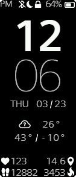

## basic ui v2 - band 5 watch face
---

pack/unpack with [`watchface-js`](https://www.npmjs.com/package/watchface-js)
```javascript
npm i -g watchface-js
wfjs writeBin -i ./res/ -m miband5
```


---


